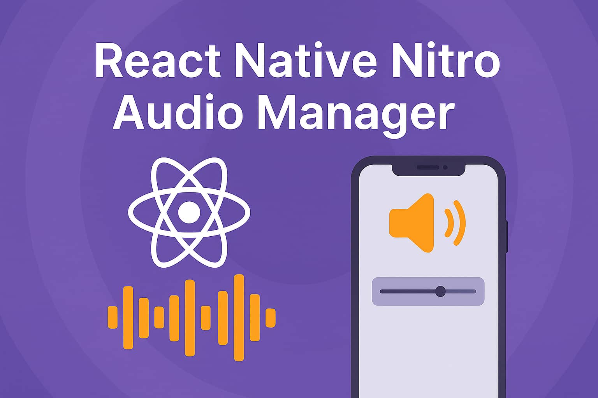

# react-native-nitro-audio-manager

> ⚠️ This package is currently in alpha and under active development. Please report any issues that you run across on either platform. 

A React Native library powered by [NitroModules](https://reactnative.dev/docs/native-modules-nitro) that gives access to [`AVAudioSession`](https://developer.apple.com/documentation/avfaudio/avaudiosession) on iOS and [`AudioManager`](https://developer.android.com/reference/android/media/AudioManager) on Android. This library is designed to give more granular control of audio sessions than what is typically needed in packages like:

- [expo-video](https://docs.expo.dev/versions/latest/sdk/video/)
- [expo-camera](https://docs.expo.dev/versions/latest/sdk/camera/)
- [react-native-video](https://github.com/react-native-video/react-native-video)
- [react-native-vision-camera](https://github.com/mrousavy/react-native-vision-camera)
- etc.

> ⚠️ When using this library alongside those packages, you'll often need to **disable or override their built-in audio session handling**, to avoid conflicts. [react-native-video](https://github.com/react-native-video/react-native-video) recently announced they will be supporting an audio session disabled [prop](https://docs.thewidlarzgroup.com/react-native-video/component/props#disableaudiosessionmanagement).

## Features
- Configure audio sessions (category, mode, options, etc.)
- Configure audio manager preferences
- Activate and deactivate sessions / audio focus
- Get device inputs/outputs (headphones, etc.)
- Get and set system volume
- Listen for system volume changes
- Listen for input/output changes
- Listen for audio interruption / category changes events

## Installation

Using npm:

```sh
npm install react-native-nitro-audio-manager react-native-nitro-modules
```

Using yarn:

```sh
yarn add react-native-nitro-audio-manager react-native-nitro-modules
```

# Documentation

## Table of Contents

- [Volume Control](#volume-control)
    - [`getSystemVolume()`](#getsystemvolume-number)
    - [`setSystemVolume()`](#setsystemvolumevalue-options-promisevoid)
    - [`useVolume()`](#usevolumenumber)
- [Listeners](#listeners)
    - [`addListener()`](#addlistenertype-listenercallback--void)
- [Inputs / Outputs](#inputs--outputs)
    - [`getOutputLatency()`](#getoutputlatency-number)
    - [`getInputLatency()`](#getinputlatency-number)
    - [`getCurrentInputRoutes()`](#getcurrentinputroutes-portdescription)
    - [`getCurrentOutputRoutes()`](#getcurrentoutputroutes-portdescription)
    - [`getCategoryCompatibleInputs()`](#getcategorycompatibleinputs-portdescription--undefined)
    - [`forceOutputToSpeaker()`](#forceoutputtospeaker-void)
    - [`cancelForcedOutputToSpeaker()`](#cancelforcedoutputtospeaker-void)
- [AudioSession / AudioFocus Management](#audiosession-ios--audiofocus-android-management)
    - [`configureAudio()`](#configureaudioparams-void)
    - [`getAudioSessionStatus()`](#getaudiosessionstatus-audiosessionstatus--audiomanagerstatus--undefined)
    - [`activate()`](#activateoptions-promisevoid)
    - [`deactivate()`](#deactivateoptions-promisevoid)


## Volume Control

### `getSystemVolume(): number`

Returns the current system volume:

- **iOS:** A single number in the range `[0–1]`. 
- **Android:** The music stream volume in the range `[0–1]` (Android has mutliple streams).

#### Example
```ts
    import { getSystemVolume } from 'react-native-nitro-audio-manager';

    const volume = getSystemVolume()
    console.log(volume) // ex. 1.0
```

### `setSystemVolume(value, options): Promise<void>` 

Sets the system between 0 and 1. 

- **value**: A number in the range [0–1]. On Android, there is a slight rounding inaccuracy. For example, `setVolume(0.5)` may set the volume to 0.53.
- **options.showUI**: (Android Only) If true, shows the system volume UI. On iOS, the system UI always appears when volume changes. *Default: true*. 

#### Example

```ts
import { setSystemVolume } from 'react-native-nitro-audio-manager';

await setSystemVolume(0.5, { showUI: true })
```

### `useVolume(): number `

A hook that gives live feedback of the volume (listens for volume changes).

#### Example

```tsx
import React from 'react';
import { View, Text, StyleSheet } from 'react-native';
import { useVolume } from 'react-native-nitro-audio-manager';

export default function VolumeDisplay() {

  const volume = useVolume(); // 0.0 to 1.0

  return (
    <View style={styles.container}>
      <Text style={styles.label}>Current Volume:</Text>
      <Text style={styles.volume}>{(volume * 100).toFixed(0)}%</Text>
    </View>
  );
}
```

## Listeners

### `addListener(type, listenerCallback): () => void`

Adds a type-safe system event listener for audio session changes.

- **type**: `'audioInterruption' | 'routeChange' | 'volume'`
- **listenerCallback**: A callback function receiving event-specific data depending on the type.

Returns an unsubscribe function that removes the listener.

---

#### Listener Types

| Type                | Event Payload                       | Description                          |
|:--------------------|:-------------------------------------|:-------------------------------------|
| `'audioInterruption'`| `InterruptionEvent`                  | Fired when an audio session is interrupted or resumed (e.g., incoming phone call, app backgrounding). |
| `'routeChange'`      | `RouteChangeEvent`                   | Fired when audio output devices change (e.g., Bluetooth connected/disconnected, headphones plugged in). |
| `'volume'`           | `number` (normalized between `0.0–1.0`) | Fired when the system volume changes. |

---

#### Example

```tsx
import { useEffect } from 'react'
import { addListener } from 'react-native-nitro-audio-manager';

useEffect(() => {

    // Listen for audio interruptions (incomming phone calls, category changes on ios, etc.)
    const removeInterruptionListener = addListener('audioInterruption', (event) => {
    console.log('Audio interruption event:', event);
    });

    // Listen for route changes (headphones connecting, etc.)
    const removeRouteChangeListener = addListener('routeChange', (event) => {
    console.log('Route changed:', event);
    });

    // Listen for volume changes
    const removeVolumeListener = addListener('volume', (volume) => {
    console.log('Volume changed:', volume);
    });

    return () => {
        removeInterruptionListener();
        removeRouteChangeListener();
        removeVolumeListener();
    }
},[])
```

## Inputs / Outputs

### `getOutputLatency(): number`

Returns the current **output latency** in **seconds**.

- **Android:** Output latency is calculated as `buffer-size / sample-rate`.  
- **IOS:** Output latency comes from [AVAudioSession.outputLatency](https://developer.apple.com/documentation/avfaudio/avaudiosession/outputlatency).

#### Example

```ts
import { getOutputLatency } from 'react-native-nitro-audio-manager';

const latency = getOutputLatency();
console.log(`Output Latency: ${latency * 1000} ms`);

```

### `getInputLatency(): number`

Returns the current **input Latency** in **seconds**.

- **Android S+ only:** Calculated using INPUT_FRAMES_PER_BUFFER and sample rate.
- **older Android:** Not available — returns -1.0.
- **IOS**: Input latency comes from [`AVAudioSession.inputLatency`](https://developer.apple.com/documentation/avfaudio/avaudiosession/inputlatency).

#### Example

```ts
import { getInputLatency } from 'react-native-nitro-audio-manager';

const latency = getInputLatency();
console.log(`Input Latency: ${latency * 1000} ms`);
```

### `getCurrentInputRoutes(): PortDescription[]`

Returns an array of the currently connected **input routes**.

- **iOS & Android:** Provides a list of active input devices, such as built-in mic, headset mic, or Bluetooth SCO.
- Always returns an array, even if empty.

#### Example

```ts
import { getCurrentInputRoutes } from 'react-native-nitro-audio-manager';

const inputs = getCurrentInputRoutes();
console.log('Current Input Routes:', inputs);
```

### `getCurrentOutputRoutes(): PortDescription[]`

Returns an array of the currently connected **output routes**.

- **iOS & Android:** Provides a list of active output devices, such as built-in speaker, Bluetooth headphones, or wired headset.
- Always returns an array, even if empty.

Example:

```ts
import { getCurrentOutputRoutes } from 'react-native-nitro-audio-manager';

const outputs = getCurrentOutputRoutes();
console.log('Current Output Routes:', outputs);
```

### `getCategoryCompatibleInputs(): PortDescription[] | undefined`

Returns an array of **available input ports** that are compatible with the currently active audio session category and mode.

> **@platform iOS only**

- If the session category is `playAndRecord`, the returned array may contain:
  - Built-in microphone
  - Headset microphone (if connected)
- If the session category is `playback`, this function returns an **empty array**.
- On **Android**, this function returns `undefined`.

#### Example

```ts
import { getCategoryCompatibleInputs } from 'react-native-nitro-audio-manager';

const inputs = getCategoryCompatibleInputs();
if (inputs) {
  console.log('Compatible input ports:', inputs);
} else {
  console.log('No inputs supported with category');
}
```

### `forceOutputToSpeaker(): void`

Temporarily forces the audio output to use the built-in **speaker**, overriding the current route.

> **@platform iOS only**

  This change remains active until:
  - The audio route changes automatically, or
  - You call `cancelForcedOutputToSpeaker()` manually.

- If you want to **permanently** prefer the speaker, you should set the `defaultToSpeaker` option when configuring your audio session category.


### `cancelForcedOutputToSpeaker(): void`

> **@platform iOS only**

Cancels the temporary forced routing to the speaker caused by `forceOutputToSpeaker()`.

#### Example

```ts
import { cancelForcedOutputToSpeaker } from 'react-native-nitro-audio-manager';

cancelForcedOutputToSpeaker();
```

## AudioSession (IOS) / AudioFocus (Android) Management

On iOS, configuring audio sessions is done manually via configuring categories, modes, options, and preferences. 

Newer android phones / later SDK versions (version 33+) handle Android focus automatically within the phone so applying some of these settings may not function on later systems.

Because of the uniqueness required for each platform and the occasional need to just set one platform (the other may work naturally), a decision was made to allow flexibility with configuring, activating, and deactivating for each platform.

### `configureAudio(params): void`

Configures a very type-safe **platform-specific audio session**.

- **iOS:** Configures the AVAudioSession with the params provided..
- **Android:** Configures the AudioManager with the params provided.

*NOTE:* If one is not provided, it ignores that platform.

---

#### Parameters

```ts
type ConfigureAudioAndActivateParams = {
  ios?: {
    category: AudioSessionCategory;
    mode?: AudioSessionMode;
    policy?: AudioSessionRouteSharingPolicy;
    categoryOptions?: AudioSessionCategoryOption[];
    prefersNoInterruptionFromSystemAlerts?: boolean;
    prefersInterruptionOnRouteDisconnect?: boolean;
    allowHapticsAndSystemSoundsDuringRecording?: boolean;
    prefersEchoCancelledInput?: boolean;
  };
  android?: {
    focusGain: AudioFocusGainType;
    usage: AudioUsage;
    contentType: AudioContentType;
    willPauseWhenDucked: boolean;
    acceptsDelayedFocusGain: boolean;
  };
};
```

---

#### Example

```ts
import { 
    configureAudio, 
    AudioSessionCategory, 
    AudioSessionMode,
    AudioSessionCategoryOptions,
    AudioContentTypes,
    AudioFocusGainTypes,
    AudioUsages
} from 'react-native-nitro-audio-manager';

await configureAudio({
  ios: {
    category: AudioSessionCategory.PlayAndRecord,
    mode: AudioSessionMode.VideoRecording,
    categoryOptions: [
        AudioSessionCategoryOptions.MixWithOthers, 
        AudioSessionCategoryOptions.AllowBluetoothHFP
    ],
    prefersNoInterruptionFromSystemAlerts: true,
    prefersInterruptionOnRouteDisconnect: true,
    allowHapticsAndSystemSoundsDuringRecording: true,
    prefersEchoCancelledInput: true, // iOS 18.2+
  },
  android: {
    focusGain: AudioFocusGainTypes.GainTransientMayDuck,
    contentType: AudioContentTypes.Music,
    usage: AudioUsages.Media,
    willPauseWhenDucked: true,
    acceptsDelayedFocusGain: true,
  },
});
```

### `getAudioSessionStatus(): AudioSessionStatus | AudioManagerStatus | undefined`

Retrieves the current audio session or audio manager configuration, depending on the platform.

- **iOS:** Returns an `AudioSessionStatus` object containing details like category, mode, options, and audio routing preferences.
- **Android:** Returns an `AudioManagerStatus` object containing details like focus gain, usage, content type, and ringer mode.

#### Example

```ts
import { Platform } from 'react-native'
import { getAudioStatus, AudioSessionStatus } from 'react-native-nitro-audio-manager';

if(Platform.OS === "ios") {
    const status = getAudioStatus() as AudioSessionStatus;
    console.log('Audio Session Status:', status.category);
}

```

#### AudioManagerStatus (Android Only)

| Property                 | Description |
|:--------------------------|:------------|
| `mode`                    | Current audio mode (e.g., `NORMAL`, `IN_COMMUNICATION`). |
| `ringerMode`              | Current ringer state (`NORMAL`, `VIBRATE`, or `SILENT`). |
| `focusGain`               | Requested focus gain type (e.g., `GAIN`, `GAIN_TRANSIENT`). |
| `usage`                   | Type of audio usage (e.g., `MEDIA`, `GAME`, `VOICE_COMMUNICATION`). |
| `contentType`             | Type of content (e.g., `MUSIC`, `MOVIE`, `SONIFICATION`). |
| `willPauseWhenDucked`     | Whether playback pauses automatically when ducked. |
| `acceptsDelayedFocusGain` | Whether delayed audio focus gain is accepted. |

---

#### AudioSessionStatus (iOS Only)

| Property                                | Description |
|:----------------------------------------|:------------|
| `category`                              | Active AVAudioSession category (e.g., `playback`, `playAndRecord`). |
| `mode`                                  | Active AVAudioSession mode (e.g., `default`, `videoRecording`). |
| `categoryOptions`                       | Array of enabled category options (e.g., `allowBluetoothHFP`, `defaultToSpeaker`). |
| `routeSharingPolicy`                    | Current route sharing policy (e.g., `default`, `longFormAudio`). |
| `isOutputtingAudioElsewhere`             | Whether audio output is being redirected to another app or device. |
| `allowHapticsAndSystemSoundsDuringRecording` | Whether haptics and system sounds are allowed while recording. |
| `prefersNoInterruptionsFromSystemAlerts` | Preference to avoid interruptions by system alerts. |
| `prefersInterruptionOnRouteDisconnect`  | Whether an interruption should occur when audio route is disconnected. |
| `isEchoCancelledInputEnabled`            | Whether echo-cancelled input is currently active. |
| `isEchoCancelledInputAvailable`          | Whether echo-cancelled input is supported by the current input device. |
| `prefersEchoCancelledInput`              | Whether echo-cancelled input is preferred when available. Can only be used with Category: 'PlayAndRecord' and Mode: 'Default' |


### `activate(options?): Promise<void>`

Activates the native audio session (iOS) or audio focus (Android).

- **iOS:** Calls `AVAudioSession.setActive(true)`.
- **Android:** Requests audio focus via `AudioManager`.
- **Other platforms:** No-op.

> ⚠️ On iOS, activating the audio session is a pretty cumbersome operation and can operate.  
> Consider deferring it slightly with `setTimeout(() => activate(), 100)` if needed.

---

#### Parameters

```ts
type ActivationOptions = {
  platform?: 'ios' | 'android' | 'both'; // Default: 'both'
};
```

- `platform`:  
  - `'ios'` → Only activate iOS AVAudioSession.  
  - `'android'` → Only activate Android audio focus.  
  - `'both'` → (default) Activate both when applicable.

---

#### Example

```ts
import { activate } from 'react-native-nitro-audio-manager';

await activate(); // activates both iOS and Android

await activate({ platform: 'ios' }); // activates only iOS
await activate({ platform: 'android' }); // activates only Android
```

---

### `deactivate(options?): Promise<void>`

Deactivates the native audio session (iOS) or abandons audio focus (Android).

- **iOS:** Calls `AVAudioSession.setActive(false)`, optionally restoring previous audio sessions.
- **Android:** Abandons audio focus via `AudioManager.abandonAudioFocus`.
- **Other platforms:** No-op.

---

#### Parameters

```ts
type DeactivationOptions = {
  platform?: 'ios' | 'android' | 'both'; // Default: 'both'
  restorePreviousSessionOnDeactivation?: boolean; // Default: true
  fallbackToAmbientCategoryAndLeaveActiveForVolumeListener?: boolean; // Default: false
};
```

- `platform`:  
  - `'ios'` → Only deactivate iOS session.  
  - `'android'` → Only abandon Android focus.  
  - `'both'` → (default) Deactivate both when applicable.
- `restorePreviousSessionOnDeactivation` (iOS only):  
  If `true`, resumes any previous audio (e.g., background music) after deactivation. Default: true.
- `fallbackToAmbientCategoryAndLeaveActiveForVolumeListener` (iOS only):  
  Used internally when listening for volume events after deactivation. Default: false

---

#### Example

```ts
import { deactivate } from 'react-native-nitro-audio-manager';

await deactivate(); // deactivates both iOS and Android

await deactivate({ platform: 'ios' }); // deactivates only iOS
await deactivate({ platform: 'android' }); // deactivates only Android

await deactivate({ restorePreviousSessionOnDeactivation: false }); // deactivate without restoring music
```


## Contributing

See the [contributing guide](CONTRIBUTING.md) to learn how to contribute to the repository and the development workflow.

## License

MIT

---

Made with [create-react-native-library](https://github.com/callstack/react-native-builder-bob)
